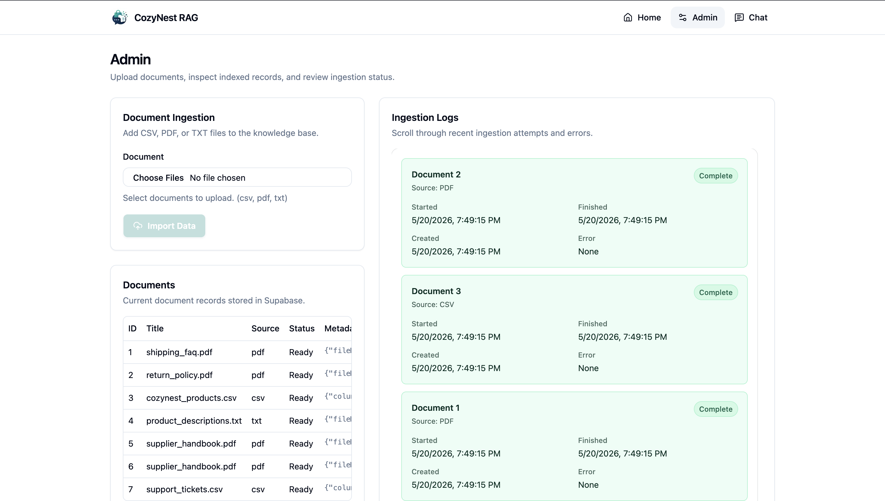
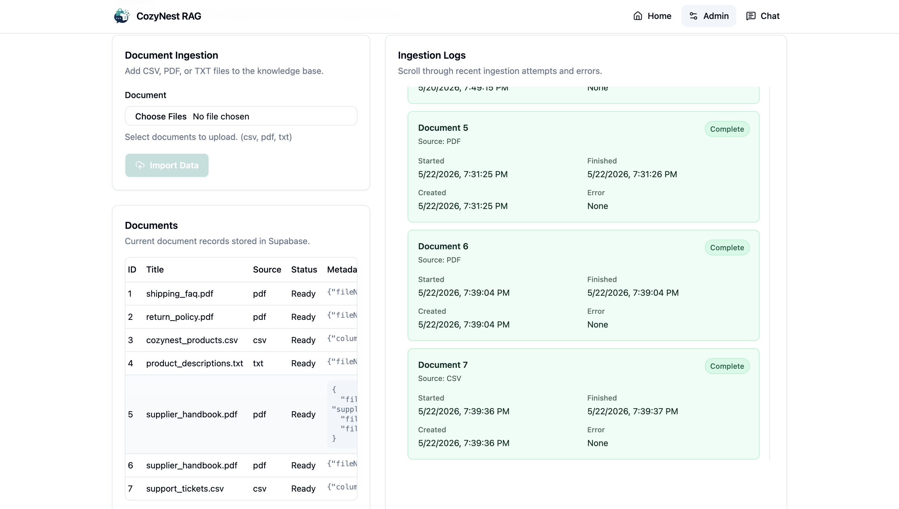
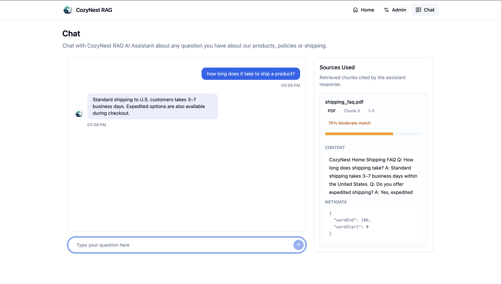
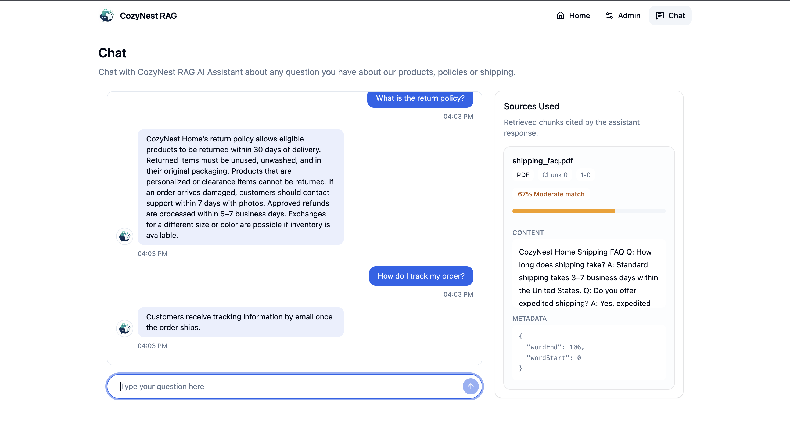

# CozyNest RAG Pipeline

CozyNest RAG Pipeline is a backend-focused e-commerce customer support assistant. It lets an admin upload store documents, indexes those documents into a Supabase/Postgres vector database, and uses retrieved context to answer customer questions with cited sources.

The project is built as a portfolio-ready RAG system rather than a generic chatbot. The main goal is to show the full path from raw support documents to grounded AI answers.

## Tech Stack

- Next.js App Router
- TypeScript
- Supabase/Postgres
- pgvector
- Gemini embeddings
- Groq chat completions
- Tailwind CSS
- shadcn/ui and Base UI components
- Zod for API response validation

## RAG Pipeline

```text
Upload -> Extract -> Chunk -> Embed -> Store -> Retrieve -> Prompt -> Answer + Sources
```

## Demo

### Video Walkthrough

[Watch the CozyNest RAG demo video](public/demo/Cozynest_RAG_Demo_Video.mp4)

### Screenshots

#### 1. Admin Ingestion



#### 2. Document and Ingestion Logs



#### 3. Basic Chat



#### 4. Chat Response With Sources



### 1. Document Upload

Admins can upload CSV, PDF, and TXT files from the admin page. Uploaded files are sent to `/api/ingest` as `FormData`.

Supported file types:

- `.csv`
- `.pdf`
- `.txt`

### 2. Text Extraction

Each file type has its own extractor:

- CSV files are parsed into structured text rows.
- PDF files are parsed into plain text.
- TXT files are read directly.

The extraction layer normalizes different document formats into text that can be chunked and embedded.

### 3. Document Records

Each ingested file creates a document record in Supabase with metadata such as:

- title
- source type
- source URI
- content hash
- ingestion status
- timestamps

The document table stores metadata about the file. The actual searchable text is stored in chunks.

### 4. Chunking

Extracted text is split into overlapping chunks (40 chars). Each chunk keeps:

- document id
- chunk index
- content
- token estimate
- metadata

### 5. Embeddings

Each chunk is embedded with Gemini and stored in Supabase using `pgvector`.

The project currently uses 768-dimensional embeddings. Query messages are embedded with the same model and dimensionality so they can be compared against stored document chunks.

### 6. Vector Retrieval

When a customer sends a message, the backend:

1. Validates the incoming message.
2. Embeds the message.
3. Calls a Supabase RPC function to compare the query embedding against stored chunk embeddings (uses cosine similarity).
4. Returns the top matching chunks.

Similarity search is handled in Postgres with pgvector instead of pulling every vector into application code.

### 7. Prompt Construction

Retrieved chunks are formatted into a grounded prompt with source ids like:

```text
[source: 7-0]
Title: support_tickets.csv
Source type: csv
Chunk index: 0
Content:
...
```

The prompt instructs the model to answer only from retrieved context and cite factual claims using the source id.

### 8. Groq Response

Groq generates the final customer support answer. The backend parses source citations from the model response, maps them back to the retrieved chunks, and returns:

- answer text
- cited sources

The frontend displays the answer in the chat and shows cited source cards with similarity scores.

## App Features

- Admin upload UI for CSV, PDF, and TXT files
- Document table showing indexed documents
- Ingestion log panel showing ingestion status and errors
- Customer chat UI
- Source panel showing cited chunks
- Similarity score progress bar for each source
- Server-side Supabase service-role client
- API validation with Zod

## Important Files

- `app/api/ingest/route.ts`: handles document uploads
- `app/api/chat/route.ts`: embeds customer messages, retrieves chunks, calls Groq, returns answer and sources
- `app/api/documents/route.ts`: returns indexed document records
- `app/api/logs/route.ts`: returns ingestion logs
- `lib/ingest/*`: file extraction helpers
- `lib/rag/chunk.ts`: chunking logic
- `lib/rag/embed.ts`: Gemini embedding logic
- `lib/rag/retrieve.ts`: Supabase vector retrieval
- `lib/rag/prompt.ts`: grounded prompt construction
- `lib/groq.ts`: Groq chat completion client
- `supabase/tables.sql`: database table setup
- `supabase/matching_functions.sql`: pgvector similarity function
- `types/ingest.ts`: ingestion and RAG TypeScript types
- `schemas/schemas.ts`: Zod schemas for API data

## Environment Variables

Create `.env.local` from `.env.example`:

```bash
cp .env.example .env.local
```

Required variables:

```bash
NEXT_PUBLIC_SUPABASE_URL=
SUPABASE_SERVICE_ROLE_KEY=
GROQ_API_KEY=
GEMINI_API_KEY=
```

The Supabase service role key must stay server-side. Do not expose it to client components.

## Development

Install dependencies:

```bash
pnpm install
```

Start the dev server:

```bash
pnpm dev
```

Run TypeScript checks:

```bash
pnpm typecheck
```

Run linting:

```bash
pnpm lint
```

## Supabase Setup

The database uses Postgres with the pgvector extension. SQL setup lives in:

- `supabase/tables.sql`
- `supabase/matching_functions.sql`

The vector column dimension must match the embedding model output dimension. This project uses 768 dimensions.

## Current Limitations

- Chat messages are not persisted.
- Message history is not sent into the chat route.
- Chat responses are not streamed yet.
- Retrieval is vector-only, not hybrid keyword plus vector search.
- There is no authentication layer around the admin page yet.

## Possible Next Improvements

- Pass recent message history into `/api/chat` for follow-up questions.
- Stream Groq responses to the frontend.
- Save chat sessions and messages.
- Add auth-protected admin access.
- Add hybrid search or metadata filters.
- Add deployment notes and screenshots.

## Portfolio Notes

This project demonstrates the core architecture of a RAG system:

- ingestion pipeline design
- file parsing
- chunking strategy
- embedding generation
- vector database storage
- similarity search with pgvector
- grounded prompt construction
- source citation mapping
- admin observability for ingested documents

It is intentionally scoped around the RAG backend and support workflow rather than broad e-commerce functionality.
